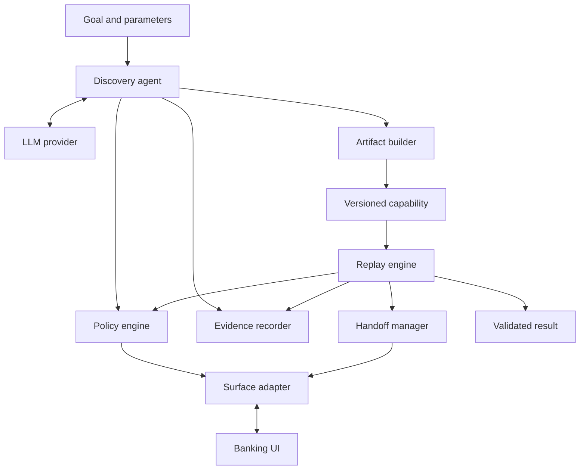

# Computer-Use Automation System

A small end-to-end system that learns a member lookup workflow through a live banking UI, saves a typed capability, and replays it with new inputs without model decisions.

The included **LedgerDesk** application contains synthetic data only. The capability returns a member's savings balance after verifying the requested member in both the outer details page and the account iframe.

## Verification status and evidence provenance

- `evidence/discovery-live-01/`: genuine live-browser discovery. The ChatGPT Work assistant observed each current UI snapshot and supplied six structured proposals through `BridgeProvider`. Five UI actions produced `capabilities/get_savings_balance/v1.json`; the sixth proposal completed the task. Inputs: synthetic member `12345`; verified output: `2500.50 USD`.
- This is an **external-model bridge run**, not an Anthropic API run. Requests, responses, model provenance and executed actions are preserved. No prerecorded decision script supplied those six discovery answers.
- The Anthropic Messages API provider is implemented and can be run with your own model/API credentials. No API key was available in the build environment, so a live Anthropic round trip was not tested.
- Replay and failure-scenario evidence is generated by `scripts.demo_scenarios`. Replay does not load model configuration or import discovery modules.
- The handoff implementation preserves one live page/context, transfers ownership, captures redacted interaction metadata, and requires explicit resume. Included handoff evidence uses an **explicitly simulated operator**, not a person. Run the headed CLI demonstration below to record an actual human takeover on your machine.
- `evidence/pytest-results.xml` and `evidence/VERIFICATION.md` record the executed test results and environment.

## Architecture



The application data lives only inside `mock_bank`. Neither discovery nor replay imports that package or calls its data directly. UI reads and actions go through `SurfaceAdapter`.

## Prerequisites and installation

Python 3.11+ and a supported Playwright operating system. Tested with Python 3.12.14 on Linux. A desktop display is needed for the human-operated `--headed` demo.

Run commands from the extracted project directory:

```bash
python -m venv .venv
```

Activate on macOS/Linux:

```bash
source .venv/bin/activate
```

Activate on Windows PowerShell:

```powershell
.venv\Scripts\Activate.ps1
```

Then, on either platform:

```bash
python -m pip install -r requirements.txt
python -m playwright install chromium
```

On Linux, install any missing system dependencies using the documented Playwright installer if your system allows it:

```bash
python -m playwright install-deps chromium
```

The build environment could not reach the standard browser CDN. Tests used a portable Chromium 153 executable with `BROWSER_EXECUTABLE_PATH`; this binary is not included in the project. Normal installations should use Playwright's bundled Chromium. You may set `BROWSER_EXECUTABLE_PATH` to a compatible local executable when needed.

## Quick replay: no model credentials required

The checked-in capability came from the included live discovery run. This command starts the app, replays the artifact for a different member, prints JSON, saves evidence, and stops the app:

```bash
python -m automation.cli replay --start-app --member-id 67890
```

Expected output fields:

```json
{"status":"success","outputs":{"balance":"8100.25","currency":"USD"}}
```

Alternatively, keep the app open in one terminal:

```bash
python -m mock_bank
```

Open `http://127.0.0.1:8000` in your browser, or run automation from a second terminal, omitting `--start-app`. Do not use `--start-app` when another server already owns port 8000.

## Live discovery using your model API

Copy `.env.example` to `.env` and set these values locally:

```dotenv
LLM_PROVIDER=anthropic
LLM_MODEL=<a Messages API model available to your account>
LLM_API_KEY=<your API key>
MAX_STEPS=25
RUN_TIMEOUT_SECONDS=180
ACTION_TIMEOUT_MS=800
HANDOFF_TIMEOUT_SECONDS=300
```

Do not commit `.env`. Run:

```bash
python -m automation.cli discover --start-app --member-id 12345 --goal "Find member 12345 and return their current savings balance"
```

Discovery opens the UI, submits sanitized observations and the strict proposal schema to the model, validates and authorizes each action, independently verifies completion, and saves the capability. A failed discovery never overwrites the last successful capability.

The default output is `capabilities/get_savings_balance/v1.json`. Use `--artifact path/to/another.json` to preserve another candidate. Replay it with the same `--artifact` option. Artifact schema and capability versions are checked; creating a new reviewed revision is an explicit repository change.

To verify replay without live model access, remove `LLM_API_KEY` from `.env` (and your shell if set) and run the quick replay command. The integration test additionally rejects every import of `automation.discovery` during replay.

## External-model bridge

This supports a tool-enabled LLM that can read/write local files. It is how the supplied live discovery was produced. Set `LLM_PROVIDER=bridge` in `.env`, then:

```bash
python -m automation.cli discover --start-app --member-id 12345 --bridge-dir .bridge/run-01 --provenance your-model-session --timeout 900
```

Use a new bridge directory for every run. While the process waits, the external LLM must read `request-001.json` and write a JSON object matching `action_schema` to `response-001.json`. Repeat for the next request. The model must choose from the *current* observation; do not prefill responses or use a fixed workflow script as discovery evidence. Prefer atomic response writes. All responses are revalidated, including target IDs and parameter bindings.

This bridge is a transport, not proof that a model responded. Provenance must be stated honestly. The included evidence identifies the actual ChatGPT Work session; test simulations are labelled separately.

## Reproducible scenarios

| Scenario | Command suffix | Expected result |
|---|---|---|
| Different member | `--member-id 67890` | `success`, `8100.25 USD` |
| Not found | `--member-id 99999` | `business_outcome`, `member_not_found` |
| Slow results | `--scenario slow_load` | Bounded wait, recovery event, success |
| Expired session unattended | `--scenario session_expired` | `intervention_required` |
| Permission denied | `--scenario permission_denied` | `hard_failure`, `PERMISSION_DENIED` |
| Duplicate links | `--scenario ambiguous` | `intervention_required`, no arbitrary click |
| Wrong member shown | `--scenario wrong_member` | Checkpoint wait exhausts; no outputs returned |
| Never finishes loading | `--scenario never_load` | At most two additional waits, then failure |
| Unknown app version | `--scenario unknown_version` | Stop before task actions |

Example:

```bash
python -m automation.cli replay --start-app --member-id 67890 --scenario slow_load
python -m automation.cli replay --start-app --member-id 99999
python -m automation.cli policy-demo --start-app
```

`policy-demo` proposes an unauthorized Transfer Funds action directly to the same policy authority. The action is rejected before any click; it does not perform a financial mutation. Its expected policy block exits with code 0. Other failed/intervention runs exit 2; successful and business-outcome runs exit 0.

Generate all noninteractive scenario evidence in one command, including the **simulated** operator integration demo:

```bash
python -m scripts.demo_scenarios
```

This command starts/stops its own app and requires the saved capability, but no LLM credentials. It never synthesizes discovery evidence.

## Real human takeover

On a machine with a desktop display:

```bash
python -m automation.cli replay --start-app --headed --handoff cli --member-id 67890 --scenario session_expired --timeout 600
```

1. Wait for `SESSION_EXPIRED` and the terminal pause notice.
2. In the automation's **existing browser window**, enter any synthetic password and click **Restore session**. Do not open another browser.
3. Return to the terminal and press Enter to resume, or type `abort` to stop.
4. The executor rechecks the live state and member identity before continuing. It does not assume the original page remains unchanged.

While `HUMAN` owns the session, automated adapter actions are rejected. Click/input/change/navigation metadata is captured on the same context; input values are excluded at the source. Network restrictions remain active. Only a human-owned session may send the synthetic `/restore` POST.

For a separate operator controller, `--handoff signal` writes `intervention.json`. After using the same visible session, write `resume.json` into that run's evidence directory:

```json
{"intervention_id":"<ID from intervention.json>","action":"resume"}
```

The token binds resume to the current intervention. Do not use signal mode without a way for the operator to access the live browser. `--handoff none` is an unattended mode: it emits the intervention request and terminates the run; it does not retain a browser after CLI exit.

## Tests

```bash
python -m pytest -v
```

Tests start their own local server, use real browser sessions, and need the installed Chromium executable. They cover strict schemas, member parameter binding, policy boundaries, redaction, outcome classifications, bounded waits, unique targeting, member checkpoints, no-model replay, and real session ownership with a simulated operator.

No tests contact a real bank or call an external LLM API. Test-only operator injection does not appear as an automatic production fallback.

## Artifacts, evidence, and configuration

| Path | Contents |
|---|---|
| `mock_bank/` | Synthetic FastAPI app, legacy tables, forms, named iframe, fault injection |
| `automation/models/` | Typed proposal, capability, checkpoint, input, output and result contracts |
| `automation/discovery/` | Provider abstraction, system prompt, live discovery loop |
| `automation/artifacts/` | Artifact builder, validation and atomic saves |
| `automation/replay/` | Deterministic execution and continuation rules |
| `automation/surface/` | Browser observation, targeting, actions, extraction and checks |
| `automation/policy/` | Configurable code-enforced authority |
| `automation/handoff/` | Ownership transitions, operator notification and resume |
| `automation/evidence/` | Sanitization and JSONL/snapshot persistence |
| `config/app.json` | Application profile and version marker |
| `config/policy.yaml` | Origins, routes, approved controls, retries and redaction |
| `capabilities/get_savings_balance/v1.json` | Actual discovered, parameterized capability |
| `evidence/<run-id>/` | Events, summary, failure UI snapshots, interventions; discovery also has model requests/responses |
| `scripts/` | Reproducible scenario runner |
| `tests/` | Unit and real-browser integration tests |

Failure evidence is a sanitized **DOM-derived structured snapshot**, retaining frame context, headings, controls, tables, and status messages. Raw DOM HTML, network traces, screenshots, credentials, and model-provider HTTP bodies are deliberately not persisted. Synthetic member IDs and balances remain visible by default to make the demonstration auditable; configurable masking is available. Returned outputs go to the caller, while persisted outputs follow the redaction policy.

## Limits and next steps

This is one supported read-only app profile, not production banking infrastructure. There is no real authentication, tenant isolation service, desktop adapter, arbitrary visual grounding, capability approval service, or distributed queue. The browser observation adapter assumes some semantic labels/table structure and one named iframe. It fails safely outside its approved target vocabulary. Other applications need a reviewed profile/adapter and sensitive-field mapping; sanitization is not a universal PII detector.

The Anthropic API integration and an actual person using the headed operator UI still need a local demonstration. Existing browser-based replay and simulated handoff evidence should not be described as proof of those two unperformed demonstrations.

See `REPORT.md` for trade-offs and the seven requested design sections. Before public submission, inspect evidence, ensure no `.env` or real credentials are included, run your live provider/human demonstrations if needed, and publish the project source to your own GitHub repository.

Reference documentation: [Playwright locators](https://playwright.dev/python/docs/locators), [Playwright browser contexts](https://playwright.dev/python/docs/api/class-browsercontext), [Pydantic models](https://pydantic.dev/docs/validation/latest/concepts/models/), [Anthropic Messages API](https://platform.claude.com/docs/en/api/messages).
