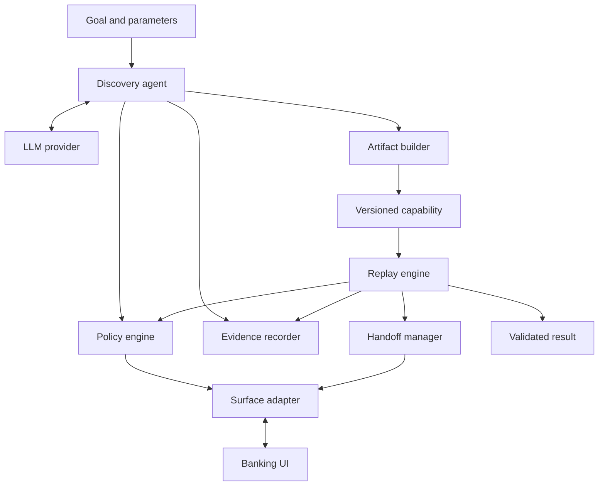

# Computer-Use Automation System

A small end-to-end system that learns a member lookup workflow through a live banking UI, saves a typed capability, and replays it with new inputs without model decisions.

The included **LedgerDesk** application contains synthetic data only. The capability returns a member's savings balance after verifying the requested member in both the outer details page and the account iframe.

## Verification status and evidence provenance

Documentation reviewed 2026-09-22 against published commit `ba957a0` and the subsequent operator-reported handoff result.

- **Successful Anthropic discovery:** `evidence/local-discover-38388153bd/` records a live UI run using `anthropic:claude-haiku-4-5-20251001`. Six model proposals produced five UI actions and a verified completion for synthetic member `12345`, returning `2500.50 USD`. This run's `capability.json` matches the current `capabilities/get_savings_balance/v1.json`.
- **Historical bridge discovery:** `evidence/discovery-live-01/` retains the earlier ChatGPT Work bridge run. Its request/response files and artifact remain separate historical evidence; it is not an Anthropic call or the source of the current artifact.
- **Successful local replay:** `evidence/my-replay-01/` returns `8100.25 USD` for member `67890` and records `llm_decisions: false`. Historical `verified-replay/` additionally records replay with an unavailable provider. The integration test rejects discovery-module imports during replay.
- **Human takeover is not yet verified end to end:** `evidence/verified-handoff-simulated/` passed with a scripted operator. The published `my-human-handoff-01` attempt timed out at step 001. A later operator-reported run, `manual-handoff-20260921-212447`, reached the pause but failed at step 004 with `CHECKPOINT_FAILED` after resume. Its failure snapshot has not been reviewed here, and its files were not present in the reviewed public commit.
- **Historical tests:** `evidence/pytest-results.xml` records 35 passes on 2026-09-14 in the original Linux environment. This is not a fresh test run against the current Anthropic-generated artifact. Run the test command below and retain the new report.

See `evidence/VERIFICATION.md` for evidence locations, provenance and outstanding checks.

## Architecture



The application data lives only inside `mock_bank`. Neither discovery nor replay imports that package or calls its data directly. UI reads and actions go through `SurfaceAdapter`.

## Prerequisites and installation

Python 3.11+ and a supported Playwright operating system. Tested with Python 3.12.14 on Linux. A desktop display is needed for the human-operated `--headed` demo.

Run commands from the repository root, where `README.md`, `REPORT.md`, `automation/` and `evidence/` are located:

```bash
python -m venv .venv
```

Activate on macOS/Linux:

```bash
source .venv/bin/activate
```

Activate on Windows PowerShell:

```powershell
.venv\Scripts\Activate.ps1
```

Then, on either platform:

```bash
python -m pip install -r requirements.txt
python -m playwright install chromium
```

On Linux, install any missing system dependencies using the documented Playwright installer if your system allows it:

```bash
python -m playwright install-deps chromium
```

The build environment could not reach the standard browser CDN. Tests used a portable Chromium 153 executable with `BROWSER_EXECUTABLE_PATH`; this binary is not included in the project. Normal installations should use Playwright's bundled Chromium. You may set `BROWSER_EXECUTABLE_PATH` to a compatible local executable when needed.

## Quick replay: no model credentials required

The checked-in capability came from the successful Anthropic discovery in `evidence/local-discover-38388153bd/`. This command starts the app, replays the artifact for a different member, prints JSON, saves evidence, and stops the app:

```bash
python -m automation.cli replay --start-app --member-id 67890
```

Expected output fields:

```json
{"status":"success","outputs":{"balance":"8100.25","currency":"USD"}}
```

Alternatively, keep the app open in one terminal:

```bash
python -m mock_bank
```

Open `http://127.0.0.1:8000` in your browser, or run automation from a second terminal, omitting `--start-app`. Do not use `--start-app` when another server already owns port 8000.

## Live discovery using your model API

Copy `.env.example` to `.env` and set these values locally:

```dotenv
LLM_PROVIDER=anthropic
LLM_MODEL=claude-haiku-4-5-20251001
LLM_API_KEY=<your API key>
MAX_STEPS=25
RUN_TIMEOUT_SECONDS=180
ACTION_TIMEOUT_MS=800
HANDOFF_TIMEOUT_SECONDS=300
```

The model identifier above is the one used in the recorded successful run; your account must have access to it. Do not commit `.env`. Run:

```bash
python -m automation.cli discover --start-app --member-id 12345 --goal "Find member 12345 and return their current savings balance"
```

Discovery opens the UI, submits sanitized observations and the strict proposal schema to the model, validates and authorizes each action, independently verifies completion, and saves the capability. A failed discovery never overwrites the last successful capability.

The default output is `capabilities/get_savings_balance/v1.json`. Use `--artifact path/to/another.json` to preserve another candidate. Replay it with the same `--artifact` option. Artifact schema and capability versions are checked; creating a new reviewed revision is an explicit repository change.

To demonstrate replay with the model provider disabled, use PowerShell:

```powershell
$env:LLM_PROVIDER = "disabled"
python -X utf8 -m automation.cli replay --start-app --member-id 67890
Remove-Item Env:LLM_PROVIDER -ErrorAction SilentlyContinue
```

Replay does not construct a provider. Removing the temporary override lets future discovery use the provider in `.env`. The integration test additionally rejects every import of `automation.discovery` during replay.

## External-model bridge

This supports a tool-enabled LLM that can read/write local files. It was used for the historical `discovery-live-01` run; the current artifact was generated through the Anthropic API. Set `LLM_PROVIDER=bridge` in `.env`, then:

```bash
python -m automation.cli discover --start-app --member-id 12345 --bridge-dir .bridge/run-01 --provenance your-model-session --timeout 900
```

Use a new bridge directory for every run. While the process waits, the external LLM must read `request-001.json` and write a JSON object matching `action_schema` to `response-001.json`. Repeat for the next request. The model must choose from the *current* observation; do not prefill responses or use a fixed workflow script as discovery evidence. Prefer atomic response writes. All responses are revalidated, including target IDs and parameter bindings.

This bridge is a transport, not proof that a model responded. Provenance must be stated honestly. The included evidence identifies the actual ChatGPT Work session; test simulations are labelled separately.

## Reproducible scenarios

| Scenario | Command suffix | Expected result |
|---|---|---|
| Different member | `--member-id 67890` | `success`, `8100.25 USD` |
| Not found | `--member-id 99999` | `business_outcome`, `member_not_found` |
| Slow results | `--scenario slow_load` | Bounded wait, recovery event, success |
| Expired session unattended | `--scenario session_expired` | `intervention_required` |
| Permission denied | `--scenario permission_denied` | `hard_failure`, `PERMISSION_DENIED` |
| Duplicate links | `--scenario ambiguous` | `intervention_required`, no arbitrary click |
| Wrong member shown | `--scenario wrong_member` | Checkpoint wait exhausts; no outputs returned |
| Never finishes loading | `--scenario never_load` | At most two additional waits, then failure |
| Unknown app version | `--scenario unknown_version` | Stop before task actions |

Example:

```bash
python -m automation.cli replay --start-app --member-id 67890 --scenario slow_load
python -m automation.cli replay --start-app --member-id 99999
python -m automation.cli policy-demo --start-app
```

`policy-demo` proposes an unauthorized Transfer Funds action directly to the same policy authority. The action is rejected before any click; it does not perform a financial mutation. Its expected policy block exits with code 0. Other failed/intervention runs exit 2; successful and business-outcome runs exit 0.

Generate all noninteractive scenario evidence in one command, including the **simulated** operator integration demo:

```bash
python -m scripts.demo_scenarios
```

This command starts/stops its own app and requires the saved capability, but no LLM credentials. It never synthesizes discovery evidence.

## Real human takeover

On a machine with a desktop display:

```bash
python -m automation.cli replay --start-app --headed --handoff cli --member-id 67890 --scenario session_expired --timeout 600
```

1. Wait for `SESSION_EXPIRED` and the terminal's explicit pause prompt.
2. In the automation's **existing browser window**, enter any synthetic password and click **Restore session**. Do not open another browser.
3. Wait until **Member details** shows member `67890` and the embedded **Accounts** section shows the **Savings account** link. Leave that link for automation to click.
4. Return to the terminal and press Enter to resume, or type `abort` to stop.
5. Confirm final `status: success` with `8100.25 USD`. A pause or a successful restore alone does not establish successful replay.

For a retained Windows demonstration, use a unique run ID and a bounded, more forgiving action timeout:

```powershell
$demoRun = "manual-handoff-" + (Get-Date -Format "yyyyMMdd-HHmmss")
$env:ACTION_TIMEOUT_MS = "3000"
python -X utf8 -m automation.cli replay --start-app --headed --handoff cli --member-id 67890 --scenario session_expired --timeout 600 --run-id $demoRun
Remove-Item Env:ACTION_TIMEOUT_MS -ErrorAction SilentlyContinue
Get-Content ".\evidence\$demoRun\summary.json"
```

The longer action timeout addresses short browser-action deadlines; it does not change the resume algorithm. The handoff wait remains bounded by `HANDOFF_TIMEOUT_SECONDS` (300 by default), within the overall run timeout.

**Known resume limitation:** replay checks the interrupted step's post-checkpoint and recorded pre-checkpoints immediately. It does not wait for a continuation checkpoint to appear or accept every later post-checkpoint. A loading iframe or manually navigating farther can therefore prevent continuation. These are possible explanations, not a confirmed diagnosis of the reported failure. Inspect the failure snapshot before changing the continuation rules; do not bypass member identity checks.

For a successful demonstration, retain `summary.json`, `events.jsonl`, `intervention.json` and the failure snapshot that triggered intervention. Check for one session ID, ownership changes through PAUSED/HUMAN/RESUMING/AUTOMATION, `human_action` events and `resume_checkpoint_validated`. Preserve failed attempts with their actual result.

While `HUMAN` owns the session, automated adapter actions are rejected. Click/input/change/navigation metadata is captured on the same context; input values are excluded at the source. Network restrictions remain active. Only a human-owned session may send the synthetic `/restore` POST.

For a separate operator controller, `--handoff signal` writes `intervention.json`. After using the same visible session, write `resume.json` into that run's evidence directory:

```json
{"intervention_id":"<ID from intervention.json>","action":"resume"}
```

The token binds resume to the current intervention. Do not use signal mode without a way for the operator to access the live browser. `--handoff none` is an unattended mode: it emits the intervention request and terminates the run; it does not retain a browser after CLI exit.

## Tests

```bash
python -X utf8 -m pytest -v --junitxml=evidence/pytest-results-local.xml
```

Record the actual final test count, failures and execution environment. A newly created report is evidence only after the command finishes; resolve failures before submission. Keep the original `pytest-results.xml` as historical evidence.

Tests start their own local server, use real browser sessions, and need the installed Chromium executable. They cover strict schemas, member parameter binding, policy boundaries, redaction, outcome classifications, bounded waits, unique targeting, member checkpoints, no-model replay, and real session ownership with a simulated operator.

No tests contact a real bank or call an external LLM API. Test-only operator injection does not appear as an automatic production fallback.

## Artifacts, evidence, and configuration

| Path | Contents |
|---|---|
| `mock_bank/` | Synthetic FastAPI app, legacy tables, forms, named iframe, fault injection |
| `automation/models/` | Typed proposal, capability, checkpoint, input, output and result contracts |
| `automation/discovery/` | Provider abstraction, system prompt, live discovery loop |
| `automation/artifacts/` | Artifact builder, validation and atomic saves |
| `automation/replay/` | Deterministic execution and continuation rules |
| `automation/surface/` | Browser observation, targeting, actions, extraction and checks |
| `automation/policy/` | Configurable code-enforced authority |
| `automation/handoff/` | Ownership transitions, operator notification and resume |
| `automation/evidence/` | Sanitization and JSONL/snapshot persistence |
| `config/app.json` | Application profile and version marker |
| `config/policy.yaml` | Origins, routes, approved controls, retries and redaction |
| `capabilities/get_savings_balance/v1.json` | Actual discovered, parameterized capability |
| `evidence/<run-id>/` | Events, summary, failure UI snapshots, interventions; discovery also has model requests/responses |
| `scripts/` | Reproducible scenario runner |
| `tests/` | Unit and real-browser integration tests |

Failure evidence is a sanitized **DOM-derived structured snapshot**, retaining frame context, headings, controls, tables, and status messages. Raw DOM HTML, network traces, screenshots, credentials, and model-provider HTTP bodies are deliberately not persisted. Synthetic member IDs and balances remain visible by default to make the demonstration auditable; configurable masking is available. Returned outputs go to the caller, while persisted outputs follow the redaction policy.

## Windows text encoding and retaining evidence

Use `python -X utf8 -m ...` for automation and test commands on Windows. Some text reads/writes still rely on the platform encoding; the UTF-8 flag avoids locale-dependent decoding and logging errors. Explicit UTF-8 throughout the source remains a portability improvement.

The current `.gitignore` excludes `evidence/local-*/`. After checking a selected run for sensitive data, explicitly include its actual generated files:

```bash
git add -f evidence/local-discover-38388153bd/
```

That successful Anthropic run is already tracked in the reviewed repository. A new `manual-handoff-...` run is not covered by that ignore rule; stage its directory after verification. Never replace run evidence with hand-written success records.

## Limits and next steps

This is one supported read-only app profile, not production banking infrastructure. There is no real authentication, tenant isolation service, desktop adapter, arbitrary visual grounding, capability approval service, or distributed queue. The browser observation adapter assumes some semantic labels/table structure and one named iframe. It fails safely outside its approved target vocabulary. Other applications need a reviewed profile/adapter and sensitive-field mapping; sanitization is not a universal PII detector.

Anthropic discovery and a different-member local replay are evidenced. The remaining submission checks are a successful human-operated handoff and a fresh test run against the current artifact. The latest reported manual run failed its continuation check; this documentation update does not fix or certify that behavior.

See `REPORT.md` for trade-offs and the seven requested design sections. Before public submission, inspect evidence, ensure no `.env` or real credentials are included, resolve the manual continuation failure, retain fresh test results, and commit the updated documents and selected run evidence to your public repository.

Reference documentation: [Playwright locators](https://playwright.dev/python/docs/locators), [Playwright browser contexts](https://playwright.dev/python/docs/api/class-browsercontext), [Pydantic models](https://pydantic.dev/docs/validation/latest/concepts/models/), [Anthropic Messages API](https://platform.claude.com/docs/en/api/messages).
